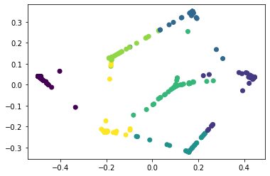

# COVA Tutorial


We are going to show how COVA works by embedding an example set of 2-dimensional data points in a new 2D space.  The goal is to preserve as well as possible the cohort structure of the data and the local neighbourhood relation between the individual data points.


## How COVA Works


First, we load the data. The example dataset contains \(n=1000\)  samples of \(d=2\) dimensions belonging to \(c=7\) cohorts. The coordinates of the data samples are stored in the matrix \(Data\), while the [**cohort membership**](./KeyKnowledge/cohortmembership.md) of each data sample is stored in \(DataCohort\).  

```python
DataInput, DataCohort = loadData('OneFlower.mat')

    def loadData(datapath):
        # The function will load the data from the local disk

        # :param datapath: could be direct path or indirect  path, right now we only support '.mat' format.
```


After loading the data, we preprocess the dataset by applying a certain scaler to the dataset. Here, we utilize the MinMax scaler to transform features by scaling each feature to a given range.

```python
Data = DataScaler(DataInput)

    def DataScaler(DataInput):
        # The function scales the dataset into a given range, here we fix the range to be [0,1]

        # :param DataInput: input data matrix in the high-dimensional space, D times n with D: feature dimension, n: number of data samples

        # :return:
        # Data: the scaled data matrix in the high-dimensional space, D times n with D: feature dimension, n: number of data samples
```


Next, we estimate the [**Cohort Distance**](./KeyKnowledge/cohortdistance.md) between any two data cohorts, and store the estimated distances  in the matrix \(D_c\). There are two different ways to calculate the cohort distance, which is selected by changing the hyper-parameter \(typeCohort\). When \(typeCohort=0\), we keep the original data cohorts, and apply the cohort distance calculation. When \(typeCohort=1\), we divide each data cohorts into several sub-cohorts using [**K-means clustering algorithm**](./KeyKnowledge/kmeansclustering.md), and calculate the cohort distance based on new generated cohorts. 

```python
Dc, newlabel = ProtoGeneration(Data, DataCohort, typeCohort=0)

    def ProtoGeneration(Data, DataCohort, typeCohort=0):
        # Cohort distance calculation.
        # The default metric is based on the Euclidean distance.
        #
        # :param Data: input data matrix in the high-dimensional space, D times n with D: feature dimension, n: number of data samples
        # :param DataCohort: input label column
        # :param typeCohort: whether to use the original data cohorts or generating new sub-cohorts. 0: original; 1: new sub-cohorts 
        #
        # :return:
        # Dc: the matrix with each indices being the distance between two cohorts
        # newlabel: keep the same to DataCohort when typeCohort=0, return the new generated data labels when typeCohort=1.
```


Taking \(D_c\) as the input, we use an [**isometry embedding**](./KeyKnowledge/isometricembedding.md) to generate cohort prototypes (one for each cohort), so that the Euclidean distances between two prototypes preserve the between-cohort distance values in  \(D_c\). Similarly, when \(typeCohort=0\), we will obtain \(c=7\) prototypes which is identical to the number of original data cohort; when \(typeCohort=1\), the obtained prototypes are more than \(7\), and here we fixing the \(c = \lfloor0.1n\rfloor\). The computed prototype embeddings are stored in the matrix \(V\). Here, the motivation of applying an isometric embedding algorithm for cohorts rather than individual points is that  an algorithm of this type, e.g., multi-dimensional embedding and ordinal embedding, has better chance to succeed when handling a small number of instances.


```python
V0 = ProtoEmbedding(Dc, DataCohort)

    def ProtoEmbedding(Data, DataCohort, embedding = 'SOE'):
        # Prototypes embedding.
        # Finding the representative points of prototypes on 2d/3d spaces
        #
        # :param Dc: the matrix with each indices being the distance between two cohorts
        # :param DataCohort: input label column 
        #
        # :return:
        # V: the embedded prototype points on the low-dimensional space
```


We also scale our embedded prototypes to a certain range by using the DataScaler

```python
V= DataScaler(V0)
```

Now, we look at  the neighbouring relations between individual points. We compute an [**adjacency matrix**](./KeyKnowledge/adjacencymatrix.md) \(W\) between the \(n=1000\) points, of which the \(ij\)th entry is set as zero if the \(i\)th and \(j\)th data points are not among the \(k=10\) nearest neighbours of each other. Ordering the data points based on their cohort memberships, we  display the computed matrix \(W\). 


```python
W = AdjacencyMatrix(Data, neighbor=10, weight=0)
 
    def AdjacencyMatrix(Data, neighbor=10, weight=0):
        # Calculate the adjacency matrix of the input data points
        #
        # :param Data: input data point matrix, D times n with n: number of data samples
        # :param neighbor: the neighborhood parameter of the data sample, default is 10
        # :param weight: whether the indices are real distance or indicators. 0: distance weight, 1: indicators
        # 
        # :return:
        # W: the output Adjacency Matrix, n times n size
```


Next, we look at the relations between  data points and data cohorts. We compute a [**confidence matrix**](./KeyKnowledge/confidencematrix.md) \(R\). Its \(ij\)th element corresponds to  a confidence value that the \(i\)th data point is from the \(j\)th data cohort. Ordering the data points based on their cohort membership, we display the computed  matrix \(R\).

```python
R = CohortConfidence(Data, DataCohort, lambda)

    def CohortConfidence(Data, DataCohort, lambda=0):
        # Calculate the cohort confidence matrix representing the confidence of each data sample belonging to a certain cohort
        #
        # :param Data: input data point matrix, D times n with n: number of data samples
        # :param DataCohort: input label column 
        # :param lambda: the parameter that controls the confidence level of each data sample, default is 0
        #
        # :return:
        # R: the output Confidence matrix, n times c size with c: number of data cohorts
```


Finally, taking the cohort prototypes \(V\), between-point adjacency matrix \(W\) and the cohort membership matrix \(R\), as the input, COVA embeds the data points in the new space around the cohort prototypes, preserving information in \(W\) and \(R\) by solving a weighted sum objective function. The embedded data points are stored in the matrix \(Z\). We display the embedded data points.


```python
result = COVA_embedding(Data, DataCohort, R, W, alpha=0.4, dim=2)

    def COVA_embedding(Data, DataCohort, R, W, alpha=0.4, dim=2):
        # The embedding process of ANGEL, finding the corresponding embedded data points in the low-dimensional space.
        #
        # :param Data: input data matrix, D times n with n: number of data samples
        # :param DataCohort: input label column 
        # :param R: confidence matrix, default lambda = 0
        # :param W: adjacency matrix, default with neighborhood = 10
        # :param dim: the dimensionality of the embedded space, default dim = 2, the other choice is dim = 3
        # :param alpha: 0: controls the balance between global and local visualizations, 0<alpha<1, where 0: the most local setting, 1: the most global setting
        #
        # :return
        # result: the embedded data points d times n with d: 2 or 3,, n: number of samples

```




## How to Run COVA

Finally, the most important part. You don't need to break COVA into different components as above, but use it by a single command. Here is an example of how to run COVA to embed an example set of images in a 2-dimensional space. First we load the data.


```python
Data, DataCohort = loadData('OneFlower.mat')
```

Then we run COVA, and display the embedded images. 

```python
result = COVA(Data, DataCohort, lambda=0, neighbor=10, dim=2, alpha=0.4, typeCohort=0)

    def COVA(Data, DataCohort, lambda=0, neighbor=10, dim=2, alpha=0.4, typeCohort=0):
        # The embedding process of ANGEL, finding the corresponding embedded data points in the low-dimensional space.
        #
        # :param Data: input data matrix, D times n with D: feature dimension, n: number of data samples
        # :param DataCohort: input label column 
        # :param lambda: the parameter that controls the confidence level of each data sample, default is 0
        # :param neighbor: the neighborhood parameter of the data sample, default is 10
        # :param dim: the dimensionality of the embedded space, default dim = 2, the other choice is dim = 3
        # :param alpha: 0: controls the balance between global and local visualizations, 0<alpha<1, where 0: the most local setting, 1: the most global setting
        # :param typeCohort: whether to use the original data cohorts or generating new sub-cohorts. 0: original; 1: new sub-cohorts 
        #
        # :return
        # result: the embedded data points d times n with d: 2 or 3,, n: number of samples
```

